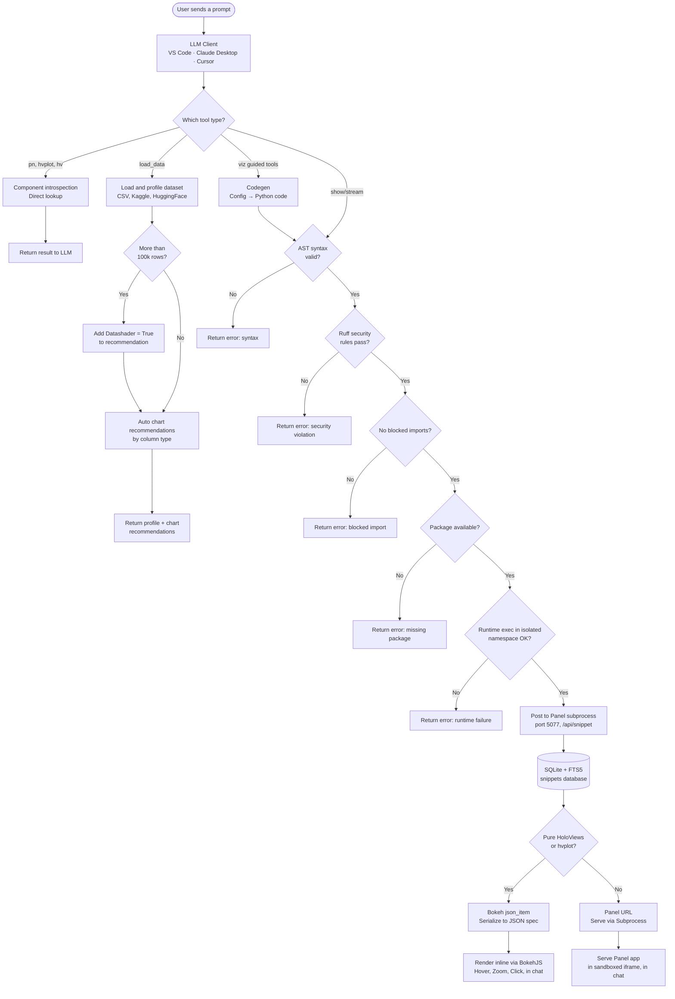

<div align="center">


&nbsp;&nbsp;&nbsp;

&nbsp;&nbsp;&nbsp;


# HoloViz MCP Server

**Let AI agents create interactive visualizations that render live inside your chat — no code required.**

Built with [FastMCP](https://github.com/jlowin/fastmcp) · [Panel](https://panel.holoviz.org) · [HoloViews](https://holoviews.org) · [hvPlot](https://hvplot.holoviz.org) · [Bokeh](https://bokeh.org)

[](https://pypi.org/project/holoviz-mcp-server/)
[](https://pypi.org/project/holoviz-mcp-server/)
[](LICENSE)

**27 MCP tools · 4 interactive UI templates · live streaming · bidirectional interaction**

</div>

---

## Demo

### 1. Inline Chart

*"Create a bar chart comparing programming language popularity: Python=32%, JavaScript=28%, Java=18%, TypeScript=12%, Others=10%"*


---

### 2. Panel Widgets & Interactivity

*"Build a Panel dashboard with a slider controlling sigma in a normal distribution, updating the histogram in real time"*


---

### 3. Streaming / Live Data

*"Create a live dashboard showing a real-time sine wave that updates every 500ms"*


---

### 4. Remote Data Loading

*"Load this dataset and profile it, then show a correlation heatmap: https://raw.githubusercontent.com/mwaskom/seaborn-data/master/tips.csv"*


---

### 5. Maps

*"Plot the top 10 most populous cities in the world on an interactive tile map with population shown as point size"*


---

### 6. Multi-Panel Dashboard

*"Build a dashboard with 3 panels: a bar chart of fruit sales (Apple=50, Banana=30, Mango=45), a pie chart of the same data, and a summary stats table"*


---

### 7. Bidirectional Interaction

*"Create an interactive scatter plot of the tips dataset where selecting points in the chart updates a summary statistics table below it"*


---

## Architecture

This project is designed as an MCP-native visualization platform: LLMs call tools, the server validates and executes visualization code safely, and users get live, interactive UIs inline in chat.

**Architecture at a glance**



### Layer responsibilities

| Layer                 | Responsibility                                                      | Key implementation modules                                                                         |
| --------------------- | ------------------------------------------------------------------- | -------------------------------------------------------------------------------------------------- |
| LLM Client Layer      | Hosts the chat UX and invokes MCP tools                             | VS Code Copilot, Claude Desktop, Cursor                                                            |
| MCP Orchestration     | Defines tool surface and namespaces                                 | `server/main.py`, `server/compose.py`, `server/guided_mcp.py`                                      |
| Validation and Safety | Enforces secure code execution before rendering                     | `validation.py`, `utils.py`, `display/database.py`                                                 |
| Display Runtime       | Runs Panel as managed subprocess, serves rendered apps              | `display/manager.py`, `display/app.py`, `display/endpoints.py`                                     |
| Persistence           | Stores every snippet and execution metadata for replay/debug/search | `display/database.py`                                                                              |
| MCP App UI            | Renders interactive outputs inline in chat sandboxes                | `templates/show.html`, `templates/dashboard.html`, `templates/stream.html`, `templates/multi.html` |
| HoloViz Stack         | Visualization abstraction and rendering backend                     | Panel, HoloViews, hvPlot, Bokeh, Param                                                             |
| Data Layer            | Ingestion and profiling for local and remote datasets               | `load_data()` tool in `server/main.py`                                                             |

### End-to-end flow

1. An agent calls a tool such as `show`, `viz.create`, or `viz.dashboard`.
2. The server runs a 5-layer validation pipeline (syntax, security, packages, extensions, runtime).
3. Validated code/config is sent to the Panel display subprocess via REST.
4. The display server executes and persists the snippet in SQLite.
5. The tool returns either:
   - a Bokeh JSON spec for direct in-chat embedding, or
   - a Panel URL rendered in an iframe.
6. MCP App templates provide rich UX (filters, theme toggle, exports, click-to-insight).

---

## Development Setup

For contributing or running from source:

### 1. Install Pixi

```bash
curl -fsSL https://pixi.sh/install.sh | bash
source ~/.bashrc
```

### 2. Clone and install

```bash
git clone https://github.com/SuMayaBee/HoloViz-MCP-Server
cd HoloViz-MCP-Server

pixi install
pixi run postinstall
```

### 3. Verify

```bash
.pixi/envs/default/bin/hvmcp --version
```

---

## Example Prompts

**Simple chart:**

```text
Create a bar chart showing: Jan=120, Feb=95, Mar=140, Apr=110
```

**Scatter plot:**

```text
Show a scatter plot of 50 random points using hvplot
```

**Full dashboard:**

```text
Create a dashboard with this sales data:
products=[Apples, Bananas, Oranges, Grapes],
revenue=[500, 300, 450, 200],
units=[50, 30, 45, 20]
```

**Load a dataset:**

```text
Load /path/to/data.csv and create a visualization
```

**Live streaming chart:**

```text
Create a live streaming chart that updates every second with random values
```

**Explore available tools:**

```text
What hvplot chart types are available?
What Panel widgets are available?
Show me the hvplot skill guide
```

---

## Features

### Core Visualization
- Ask your AI assistant to create a chart — renders **inline in the chat** via MCP Apps
- Interactive charts (zoom, pan, hover) powered by Bokeh
- Every visualization persisted and accessible via URL
- Works in VS Code Insiders, Claude Desktop, and Cursor

### View Code Button
Every chart rendered inline has a **View Code** button in the toolbar — click it to see the exact Python that generated the visualization, with a one-click copy. Great for learning HoloViz.

### Kaggle Integration
Paste any Kaggle dataset or competition URL directly into the chat:
```text
Load https://www.kaggle.com/datasets/uciml/iris and show a scatter plot colored by species
```
Requires `KAGGLE_USERNAME` and `KAGGLE_KEY` in your MCP config env (free Kaggle account).

### HuggingFace Datasets
Paste any HuggingFace dataset URL and get instant EDA:
```text
Load https://huggingface.co/datasets/scikit-learn/iris and show a correlation heatmap
```
`HF_TOKEN` is optional — only needed for private datasets.

### Automatic Chart Recommendations
After `load_data()`, the server analyses column types and returns up to 3 ready-to-render chart recommendations with working hvplot code — no manual chart selection needed.

### Datashader for Big Data
Datasets with >100k rows automatically use `datashade=True` in all recommended chart code — rendering stays fast regardless of dataset size.

### Live Streaming Dashboards
Real-time dashboards with periodic callbacks — sine waves, counters, live feeds — all rendered inline.

### Maps
Interactive tile maps using hvPlot + GeoViews:
```text
Plot the top 10 most populous cities on an interactive map with population as point size
```

---

## Tools

| Tool                                       | Description                                                                          |
| ------------------------------------------ | ------------------------------------------------------------------------------------ |
| `show(code)`                               | Execute Python viz code, render as live UI with View Code button                     |
| `stream(code)`                             | Execute streaming Panel code with periodic callbacks                                 |
| `load_data(source)`                        | Profile a dataset + auto chart recommendations. Supports CSV, Parquet, Kaggle, HuggingFace, S3 |
| `validate(code)`                           | Run 5-layer validation before show()                                                 |
| `viz.create`                               | High-level: describe a chart in plain config, no Python needed                       |
| `viz.dashboard`                            | Create a multi-panel dashboard from structured config                                |
| `viz.stream`                               | Create a live streaming visualization                                                |
| `viz.multi`                                | Create a multi-chart grid with linked selections                                     |
| `pn.list / pn.get / pn.params / pn.search` | Panel component introspection                                                        |
| `hvplot.list / hvplot.get`                 | hvPlot chart type discovery                                                          |
| `hv.list / hv.get`                         | HoloViews element discovery                                                          |
| `skill_list / skill_get`                   | Access best-practice guides for Panel, hvPlot, HoloViews                             |
| `list_packages`                            | List installed packages in the server environment                                    |

---

## Project Structure

```
src/holoviz_mcp_server/
├── cli.py               # CLI entry point (hvmcp serve / mcp / status)
├── config.py            # Pydantic config + env var loading
├── validation.py        # 5-layer code validation pipeline
├── utils.py             # Code execution, extension detection utilities
│
├── server/              # MCP server layer (FastMCP)
│   ├── main.py          # Main server + core tools (show, stream, load_data, ...)
│   ├── compose.py       # Mounts all sub-servers with namespaces
│   ├── guided_mcp.py    # viz.* tools (create, dashboard, stream, multi)
│   ├── panel_mcp.py     # pn.* tools
│   ├── hvplot_mcp.py    # hvplot.* tools
│   └── holoviews_mcp.py # hv.* tools
│
├── codegen/             # Code generators (config → Python)
│   └── codegen.py
│
├── introspection/       # Pure Python discovery functions
│   ├── panel.py         # Panel component discovery
│   ├── holoviews.py     # HoloViews element discovery
│   ├── hvplot.py        # hvPlot chart type discovery
│   └── skills.py        # Skill file loading
│
├── display/             # Panel display server (runs as subprocess)
│   ├── app.py           # Panel server entry point
│   ├── manager.py       # Subprocess lifecycle management
│   ├── client.py        # HTTP client (MCP → Panel)
│   ├── database.py      # SQLite + FTS5 persistence
│   ├── endpoints.py     # REST handlers (/api/snippet, /api/health)
│   └── pages/           # Web UI pages (feed, view, add, admin)
│
├── templates/           # MCP App HTML (inline rendering in chat)
│   ├── show.html        # Chart viewer + click-to-insight
│   ├── stream.html      # Live streaming viewer
│   ├── dashboard.html   # Dashboard viewer
│   └── multi.html       # Multi-chart grid
│
└── skills/              # Best-practice guides (SKILL.md files)
    ├── panel/
    ├── hvplot/
    ├── holoviews/
    ├── param/
    └── data/
```

---

## Installation

> **Prerequisite:** Install [`uv`](https://docs.astral.sh/uv/) first:
> ```bash
> # macOS / Linux
> curl -LsSf https://astral.sh/uv/install.sh | sh
> # Windows
> powershell -ExecutionPolicy ByPass -c "irm https://astral.sh/uv/install.sh | iex"
> # Or via pip
> pip install uv
> ```

<details>
<summary><b>VS Code / Copilot Chat (Recommended)</b></summary>

Add to your global `~/.config/Code - Insiders/User/mcp.json` or workspace `.vscode/mcp.json`:

```json
{
  "servers": {
    "holoviz": {
      "type": "stdio",
      "command": "uvx",
      "args": ["--from", "holoviz-mcp-server", "hvmcp", "mcp"]
    }
  }
}
```

Open Copilot Chat (`Ctrl+Alt+I`) → switch to **Agent** mode → start chatting.

</details>

<details>
<summary><b>Claude Desktop</b></summary>

Add to `~/Library/Application Support/Claude/claude_desktop_config.json` (macOS) or `%APPDATA%\Claude\claude_desktop_config.json` (Windows):

```json
{
  "mcpServers": {
    "holoviz": {
      "command": "uvx",
      "args": ["--from", "holoviz-mcp-server", "hvmcp", "mcp"]
    }
  }
}
```

Restart Claude Desktop.

</details>

<details>
<summary><b>Cursor</b></summary>

Add to `~/.cursor/mcp.json`:

```json
{
  "mcpServers": {
    "holoviz": {
      "command": "uvx",
      "args": ["--from", "holoviz-mcp-server", "hvmcp", "mcp"]
    }
  }
}
```

</details>

<details>
<summary><b>Claude Code / Other stdio clients</b></summary>

```json
{
  "mcpServers": {
    "holoviz": {
      "command": "uvx",
      "args": ["--from", "holoviz-mcp-server", "hvmcp", "mcp"]
    }
  }
}
```

</details>

### Optional: Kaggle & HuggingFace Integration

To load datasets directly from Kaggle or HuggingFace URLs, add credentials to the `env` section of your config:

```json
{
  "env": {
    "KAGGLE_USERNAME": "your_kaggle_username",
    "KAGGLE_KEY": "your_kaggle_api_key",
    "HF_TOKEN": "your_huggingface_token"
  }
}
```

- **Kaggle token**: [kaggle.com](https://www.kaggle.com) → Account → Settings → **Create New Token**
- **HuggingFace token**: [huggingface.co](https://huggingface.co) → Settings → Access Tokens → **New token** (Read role)

`HF_TOKEN` is optional — only needed for private HuggingFace datasets. If credentials are not provided, Kaggle/HuggingFace URLs will return a friendly message instead of failing silently.

**Example prompts once configured:**

```text
Load https://www.kaggle.com/datasets/uciml/iris and show a scatter plot colored by species
```

```text
Load https://huggingface.co/datasets/scikit-learn/iris and show a correlation heatmap
```

---

## License

BSD 3-Clause

