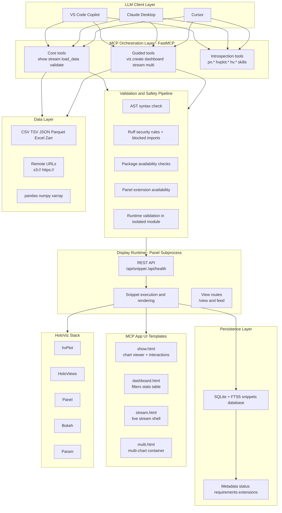

# HoloViz MCP Server

An MCP server for the HoloViz ecosystem. Lets AI agents (Claude, Copilot, Cursor) create interactive visualizations and dashboards that render as live UIs directly inside LLM chat via MCP Apps.

Built on Panel, HoloViews, hvPlot, and FastMCP.

---

## Installation

### VS Code / Cursor

Add to your `mcp.json` (or `.vscode/mcp.json`):

```json
{
  "mcpServers": {
    "holoviz": {
      "command": "uvx",
      "args": ["holoviz-mcp-server", "mcp"]
    }
  }
}
```

### Claude Desktop

Add to `~/Library/Application Support/Claude/claude_desktop_config.json` (macOS) or `%APPDATA%\Claude\claude_desktop_config.json` (Windows):

```json
{
  "mcpServers": {
    "holoviz": {
      "command": "uvx",
      "args": ["holoviz-mcp-server", "mcp"]
    }
  }
}
```

### Requirements

- Python 3.11+
- `uv` — required to run `uvx`. Install it first:
  ```bash
  # macOS / Linux
  curl -LsSf https://astral.sh/uv/install.sh | sh

  # Windows
  powershell -ExecutionPolicy ByPass -c "irm https://astral.sh/uv/install.sh | iex"

  # Or via pip
  pip install uv
  ```
- Port 5077 available (Panel display server)

---

## Architecture

This project is designed as an MCP-native visualization platform: LLMs call tools, the server validates and executes visualization code safely, and users get live, interactive UIs inline in chat.

### Architecture at a glance



### Layer responsibilities

| Layer                 | Responsibility                                                      | Key implementation modules                                                                         |
| --------------------- | ------------------------------------------------------------------- | -------------------------------------------------------------------------------------------------- |
| LLM Client Layer      | Hosts the chat UX and invokes MCP tools                             | VS Code Copilot, Claude Desktop, Cursor                                                            |
| MCP Orchestration     | Defines tool surface and namespaces                                 | `server/main.py`, `server/compose.py`, `server/guided_mcp.py`                                      |
| Validation and Safety | Enforces secure code execution before rendering                     | `validation.py`, `utils.py`, `display/database.py`                                                 |
| Display Runtime       | Runs Panel as managed subprocess, serves rendered apps              | `display/manager.py`, `display/app.py`, `display/endpoints.py`                                     |
| Persistence           | Stores every snippet and execution metadata for replay/debug/search | `display/database.py`                                                                              |
| MCP App UI            | Renders interactive outputs inline in chat sandboxes                | `templates/show.html`, `templates/dashboard.html`, `templates/stream.html`, `templates/multi.html` |
| HoloViz Stack         | Visualization abstraction and rendering backend                     | Panel, HoloViews, hvPlot, Bokeh, Param                                                             |
| Data Layer            | Ingestion and profiling for local and remote datasets               | `load_data()` tool in `server/main.py`                                                             |

### End-to-end flow

1. An agent calls a tool such as `show`, `viz.create`, or `viz.dashboard`.
2. The server runs a 5-layer validation pipeline (syntax, security, packages, extensions, runtime).
3. Validated code/config is sent to the Panel display subprocess via REST.
4. The display server executes and persists the snippet in SQLite.
5. The tool returns either:
   - a Bokeh JSON spec for direct in-chat embedding, or
   - a Panel URL rendered in an iframe.
6. MCP App templates provide rich UX (filters, theme toggle, exports, click-to-insight).

### Why this architecture is a strong GSoC fit

This directly implements the GSoC idea of "Panel / HoloViews MCP Integration" by delivering:

- MCP Apps-first UX: visualizations are returned as interactive UI resources, not plain text.
- Agent-native workflows: LLMs can create, modify, filter, annotate, and export visual outputs.
- Safe execution model: multi-layer validation plus controlled subprocess execution.
- Real interoperability: works across major MCP clients and supports local/remote data sources.
- Extensible design: namespaced tools (`viz`, `pn`, `hvplot`, `hv`) keep growth manageable for future capabilities.

In short, the project turns HoloViz into a first-class interactive runtime for agent conversations, which is exactly the core value proposed in the GSoC problem statement.

---

## What it does

- Ask your AI assistant to create a chart — it renders **inline in the chat**
- Charts are interactive (zoom, pan, hover) powered by Bokeh
- Every visualization is persisted and accessible via URL
- Works in VS Code Insiders (Copilot), Claude Desktop, and Cursor

---

## Requirements

- Python 3.11+
- [Pixi](https://pixi.sh) — environment manager

---

## Installation

### 1. Install Pixi

```bash
curl -fsSL https://pixi.sh/install.sh | bash
source ~/.bashrc
```

### 2. Clone and install

```bash
git clone <your-repo-url>
cd Panel-mcp-live

pixi install
pixi run postinstall
```

### 3. Verify

```bash
.pixi/envs/default/bin/hvmcp --version
```

---

## VS Code Setup (Insiders)

VS Code Insiders supports inline MCP App rendering — charts appear directly inside the chat panel.

### Step 1 — Install VS Code Insiders

Download from [code.visualstudio.com/insiders](https://code.visualstudio.com/insiders). Make sure the **GitHub Copilot** extension is installed and you are signed in.

### Step 2 — Create the MCP config

Create `.vscode/mcp.json` in your workspace root (this repo already has one):

```json
{
  "servers": {
    "holoviz": {
      "type": "stdio",
      "command": "/absolute/path/to/Panel-mcp-live/.pixi/envs/default/bin/hvmcp",
      "args": ["mcp"]
    }
  }
}
```

> Replace `/absolute/path/to/Panel-mcp-live` with the actual path on your machine.
> On Linux/Mac you can get it by running `pwd` inside the project folder.

### Step 3 — Start the server

1. Open `.vscode/mcp.json` in VS Code Insiders
2. You will see **Start | Stop | Restart | 22 tools** links appear inline above the `"servers"` line
3. Click **Start**

The server starts automatically — no terminal commands needed. It will:

- Launch the MCP server (`hvmcp mcp`)
- Auto-start the Panel display server subprocess on port 5077
- Print `HoloViz MCP App is running. Feed: http://127.0.0.1:5077/feed` in the MCP output log

### Step 4 — Open Copilot Chat in Agent mode

1. Open Copilot Chat: `Ctrl+Alt+I`
2. Switch to **Agent** mode using the dropdown at the bottom of the chat
3. Make sure `mcp.json` is listed as a context source (the `{}` icon at the bottom)

### Step 5 — Try it

```
Create a bar chart showing: Jan=120, Feb=95, Mar=140, Apr=110
```

A bar chart renders inline in the chat. Click **Open visualization** to open it in Simple Browser inside VS Code.

---

## Claude Desktop Setup

Add to `~/.config/Claude/claude_desktop_config.json` (create if it doesn't exist):

```json
{
  "mcpServers": {
    "holoviz": {
      "command": "/absolute/path/to/Panel-mcp-live/.pixi/envs/default/bin/hvmcp",
      "args": ["mcp"]
    }
  }
}
```

Restart Claude Desktop. The server starts automatically when Claude launches.

---

## Cursor Setup

Create or edit `~/.cursor/mcp.json`:

```json
{
  "mcpServers": {
    "holoviz": {
      "command": "/absolute/path/to/Panel-mcp-live/.pixi/envs/default/bin/hvmcp",
      "args": ["mcp"]
    }
  }
}
```

---

## Example Prompts

**Simple chart:**

```
Create a bar chart showing: Jan=120, Feb=95, Mar=140, Apr=110
```

**Scatter plot:**

```
Show a scatter plot of 50 random points using hvplot
```

**Full dashboard:**

```
Create a dashboard with this sales data:
products=[Apples, Bananas, Oranges, Grapes],
revenue=[500, 300, 450, 200],
units=[50, 30, 45, 20]
```

**Load a dataset:**

```
Load /path/to/data.csv and create a visualization
```

**Live streaming chart:**

```
Create a live streaming chart that updates every second with random values
```

**Explore available tools:**

```
What hvplot chart types are available?
What Panel widgets are available?
Show me the hvplot skill guide
```

---

## Tools

| Tool                                       | Description                                                    |
| ------------------------------------------ | -------------------------------------------------------------- |
| `show(code)`                               | Execute Python viz code, render as live UI                     |
| `stream(code)`                             | Execute streaming Panel code with periodic callbacks           |
| `load_data(source)`                        | Profile a dataset (CSV, Parquet, JSON, S3, etc.)               |
| `validate(code)`                           | Run 5-layer validation before show()                           |
| `viz.create`                               | High-level: describe a chart in plain config, no Python needed |
| `viz.dashboard`                            | Create a multi-panel dashboard from structured config          |
| `viz.stream`                               | Create a live streaming visualization                          |
| `viz.multi`                                | Create a multi-chart grid with linked selections               |
| `pn.list / pn.get / pn.params / pn.search` | Panel component introspection                                  |
| `hvplot.list / hvplot.get`                 | hvPlot chart type discovery                                    |
| `hv.list / hv.get`                         | HoloViews element discovery                                    |
| `skill_list / skill_get`                   | Access best-practice guides for Panel, hvPlot, HoloViews       |
| `list_packages`                            | List installed packages in the server environment              |

---

## Project Structure

```
src/holoviz_mcp_server/
├── cli.py               # CLI entry point (hvmcp serve / mcp / status)
├── config.py            # Pydantic config + env var loading
├── validation.py        # 5-layer code validation pipeline
├── utils.py             # Code execution, extension detection utilities
│
├── server/              # MCP server layer (FastMCP)
│   ├── main.py          # Main server + core tools (show, stream, load_data, ...)
│   ├── compose.py       # Mounts all sub-servers with namespaces
│   ├── guided_mcp.py    # viz.* tools (create, dashboard, stream, multi)
│   ├── panel_mcp.py     # pn.* tools
│   ├── hvplot_mcp.py    # hvplot.* tools
│   └── holoviews_mcp.py # hv.* tools
│
├── codegen/             # Code generators (config → Python)
│   └── codegen.py
│
├── introspection/       # Pure Python discovery functions
│   ├── panel.py         # Panel component discovery
│   ├── holoviews.py     # HoloViews element discovery
│   ├── hvplot.py        # hvPlot chart type discovery
│   └── skills.py        # Skill file loading
│
├── display/             # Panel display server (runs as subprocess)
│   ├── app.py           # Panel server entry point
│   ├── manager.py       # Subprocess lifecycle management
│   ├── client.py        # HTTP client (MCP → Panel)
│   ├── database.py      # SQLite + FTS5 persistence
│   ├── endpoints.py     # REST handlers (/api/snippet, /api/health)
│   └── pages/           # Web UI pages (feed, view, add, admin)
│
├── templates/           # MCP App HTML (inline rendering in chat)
│   ├── show.html        # Chart viewer + click-to-insight
│   ├── stream.html      # Live streaming viewer
│   ├── dashboard.html   # Dashboard viewer
│   └── multi.html       # Multi-chart grid
│
└── skills/              # Best-practice guides (SKILL.md files)
    ├── panel/
    ├── hvplot/
    ├── holoviews/
    ├── param/
    └── data/
```

---

## Environment Variables

All variables use the `HOLOVIZ_MCP_SERVER_` prefix.

| Variable       | Default                                      | Description                                   |
| -------------- | -------------------------------------------- | --------------------------------------------- |
| `PORT`         | `5077`                                       | Panel server port                             |
| `HOST`         | `127.0.0.1`                                  | Panel server host                             |
| `MAX_RESTARTS` | `3`                                          | Max Panel subprocess restart attempts         |
| `DB_PATH`      | `~/.holoviz-mcp-server/snippets/snippets.db` | SQLite database path                          |
| `EXTERNAL_URL` | _(auto)_                                     | Public URL override (JupyterHub / Codespaces) |
| `SKILLS_DIR`   | _(builtin)_                                  | Path to custom skills directory               |

Auto-detects JupyterHub (`JUPYTERHUB_SERVICE_PREFIX`) and GitHub Codespaces (`CODESPACE_NAME`) to build the correct external URL.

---

## Troubleshooting

### "Panel server not running. Ensure port 5077 is available."

The Panel display server failed to start. Most common cause: port 5077 is still held by a previous run.

```bash
# Free the port
fuser -k 5077/tcp

# Then restart the MCP server in VS Code (Stop → Start in mcp.json)
```

### Server restarts but Panel fails on second start

This happens when VS Code rapidly stops and restarts the MCP server — the OS socket is briefly in TIME_WAIT. The manager waits up to 5 seconds for the port to clear automatically. If it still fails, free the port manually (see above).

### Check MCP server logs

In VS Code: bottom panel → **Output** tab → select **MCP: holoviz** from the dropdown.

### Check Panel server health

```bash
.pixi/envs/default/bin/hvmcp status
# Running  http://127.0.0.1:5077/feed  (healthy at 2026-03-27T12:14:17)
```

### No inline visualization, only a link

Inline chart rendering (MCP Apps) requires **VS Code Insiders** with GitHub Copilot. In stable VS Code or other clients, you get a clickable URL instead — clicking it opens the chart in Simple Browser or your browser.

---

## Development

```bash
pixi run test            # Run tests
pixi run test-coverage   # Run tests with coverage report
pixi run lint            # Check code style (ruff)
pixi run format          # Auto-format code (ruff)
pixi run postinstall     # Re-install after structural changes
```

---

## License

BSD 3-Clause
